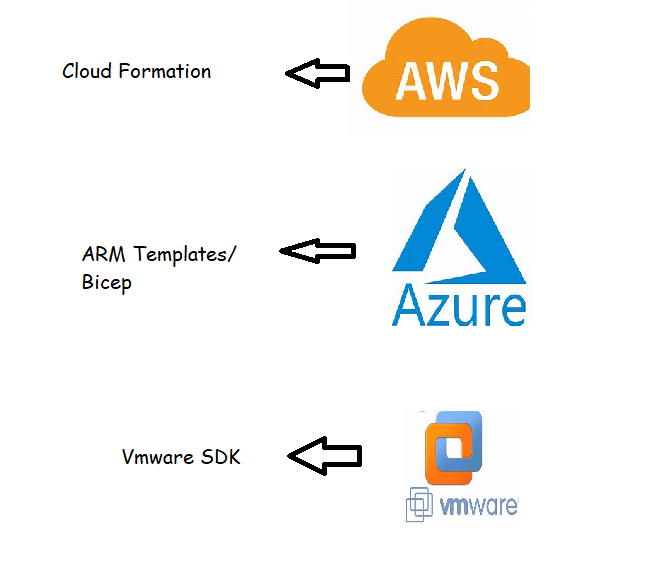
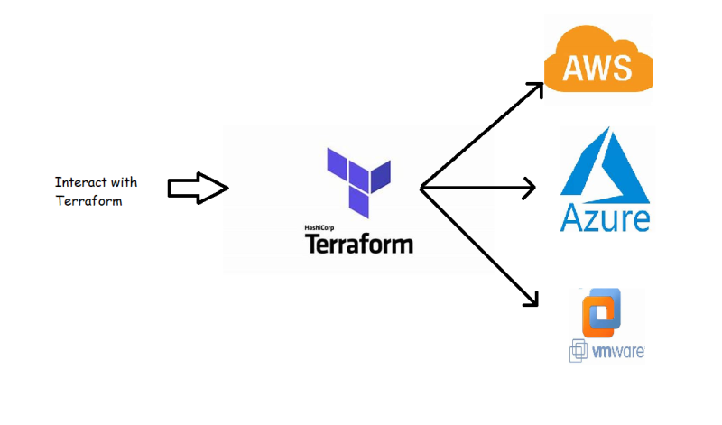
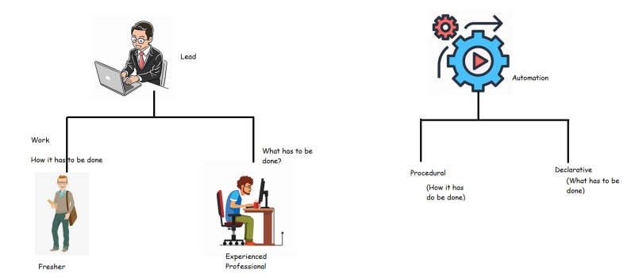
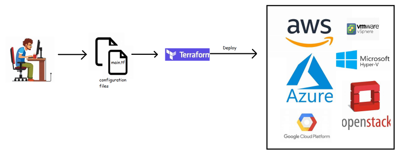
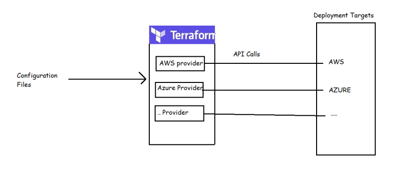

### Need for Infrastructure Provisioning

* In CI/CD pipelines, we need to create various test environments according to organizational QA policy.

* To create test environments, we might also need to create virtual infrastructure on the cloud / Hypervisor (VMWare, Hyper-V).

* To automate this infrastructure creation/updation we need some kind of a tool and these tools are called as Infra Provisioning Tools

* Depending on the infrastructure used in the organization we will have different tools which can help us in automating infrastructure creation

* To solve this problem an organization called as Hashicorp has came up with a tool called as Terraform which can work with multiple infra providers

* Procedural vs Declarative

* Using Terraform we would use declarative approach to specify what are our infrastructure needs => Infrastructure as Code (IaC)

* Workflow: 

* Terraform is Cloud-agnostic because deploy to any cloud or virtual infra provider

* Terraform integrates with different clouds through Terrraform providers
