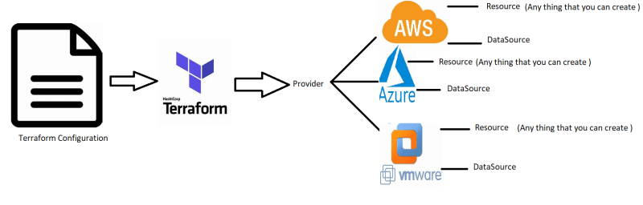

### Terraform
* Software isn’t done until you deliver it to the customers.
* What Terraform Does?


## Infrastructure as code (IAC)
* The idea behind IAC is that you write & execute the code to define, deploy, update and destroy your infrastructure
* Consider the following as the architecture of Redbus Application


* Now lets assume RedBus is working on AWS


* Now lets assume Redbus is working on Azure


```yaml
# AWS
resource "aws_instance" "app" {
    instance_type       = "t2.micro"
    ami                 = "ami-892347389247"
    availability_zone   = "us-west-2a"
}

# Azure 
resource "azurerm_vm" "app" {
    size                = "Standard_B1s"
    vmimage             = "ubuntu2004LTS"
    location            = "eastus"
}

#vmware

resource "vmware_vm" "app"  {
    cpu     = "2"
    ram     = "4GB"
    image   = "ubuntu"  
}
```



* The major concepts of terraform are
    * Provider:
        * Where we can create infrastructure
    * Resource:
        * What has to be created
    * DataSource:
        * Query information about anything in the Provider

* Relevance of Terraform in CI/CD Pipeline

