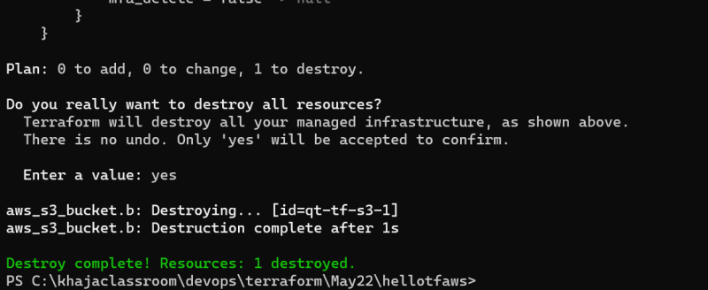

### Installing Terraform
* Windows: We have two options for installing terraform
    * Chocolatey:
         * Install chocolatey [Refer Here](https://chocolatey.org/install)
Use Chocolatey to install terraform ``` choco install terraform ```
Manually configure terraform [Refer Here](https://www.terraform.io/downloads)
Mac: [Refer Here](https://formulae.brew.sh/formula/terraform) ``` brew install terraform ```

## Working with Terraform
* Identify the infrastructure you need to create/provision
* Identify the providers
* Configure the provider using HCL (Hashicorp Configuration Language)
* Configure the resources to be created using HCL

### Activity 1: Create an S3 Bucket in AWS
* Manual Steps: Login to the AWS Account


* Provider is where to create infra and Resource is what we are trying to create.
* In the above case
    * Provider: AWS
    * Resource: S3 Bucket
* In AWS to connect to aws account we had to login using email and password.
* Generally Provider configuration involves authentication and it depends on how provider allows it.
* [Refer Here](https://registry.terraform.io/browse/providers) for the terraform providers
* AWS Provider documentation


* To work with AWS Provider we need access key and secret key, lets see how to generate it [Refer Here](https://sst.dev/chapters/create-an-iam-user.html)
* [Refer Here](https://registry.terraform.io/providers/hashicorp/aws/latest/docs/resources/s3_bucket) for the documentation of the s3 bucket
* Now lets try to create infra from terraform


* Initialize the directory


* Validate the configuration


* Now lets create the infrastructure ``` terraform apply ```


* Now to remove the infra ``` terraform destroy ```



* The configuration which we used

```yaml
provider "aws" {
    access_key  = "<your-access-key>"
    secret_key  = "<your-secret-key>"
    region      = "ap-south-1"
}

resource "aws_s3_bucket" "b" {
  bucket = "qt-tf-s3-1"

  tags = {
    Name        = "My bucket"
    Environment = "Dev"
  }
}
```
## Terraform Language
* Terraform configuration can be expressed in
    * HCL/Terraform Language
    * JSON
* The two major elements in the Terraform language are
    * Arguments:
        * Assigns a value to a particular name ``` bucket = "qt-tf-s3-1" ```
    * Blocks:
        * A block is container for other content
        * Three major blocks of terraform are
            * provider block
            * resource block
            * datasource block

## Provider Block:
* Basic Syntax:

```yaml
provider "<provider-name>" {
    <argument-1>
    <argument-2>
    ..
    <argument-n>
}
```
* Example

```yaml
provider "aws" {
    access_key  = "LKJLKSKLJDALDJLKSADSLA"
    secret_key  = "lksdfjdlkasfjlsadfjlksdafjlksdafjdallksafj"
    region      = "ap-south-1"
}
```

## Resource Block
* Basic Syntax

```yaml
resource "<PROVIDER>_<TYPE>" "<NAME>" {
    <argument-1>
    <argument-2>
    ..
    <argument-n>
}
```
* Example

```yaml
resource "aws_s3_bucket" "b" {
  bucket = "qt-tf-s3-1"

  tags = {
    Name        = "My bucket"
    Environment = "Dev"
  }
}
```

## Cloud Account Creations
* AWS: Free Tier Account
* AZURE: Free Tier Account


