### Terraform contd
* The inputs provided to the Resources/Datasources is called as arguments and the outputs are referred as attributes.

## Activity 1: AWS Infrastructure Simple
* Lets try to create the below infrastructure using terraform

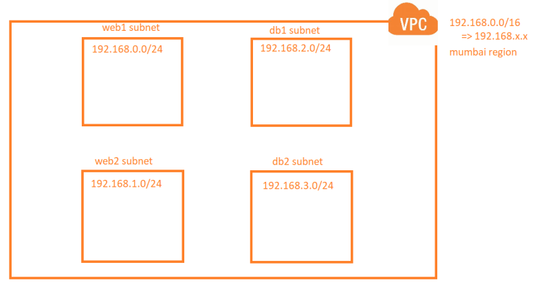

* Manual Steps

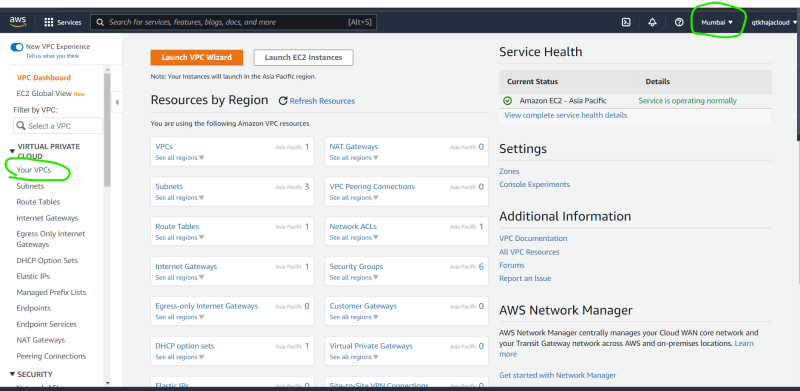

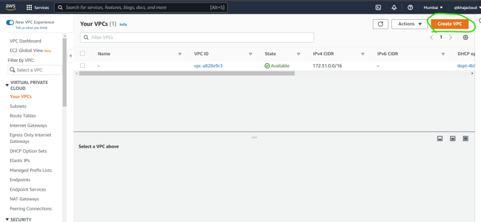

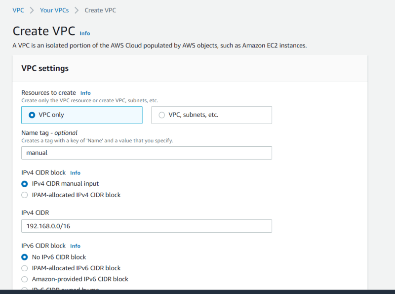

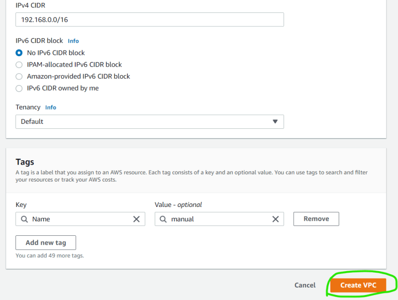

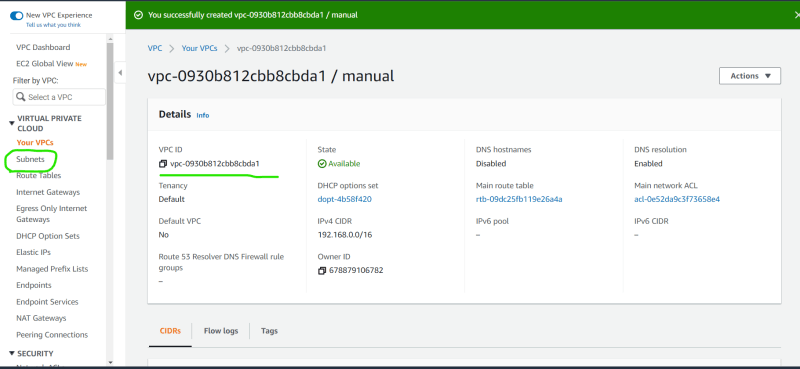

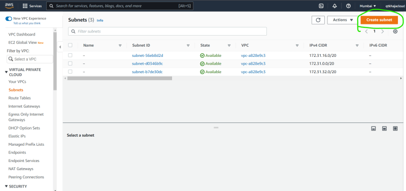

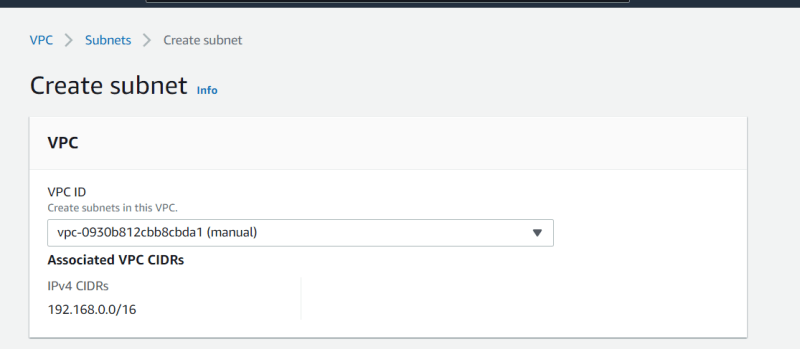

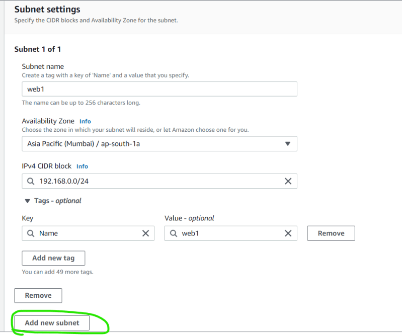

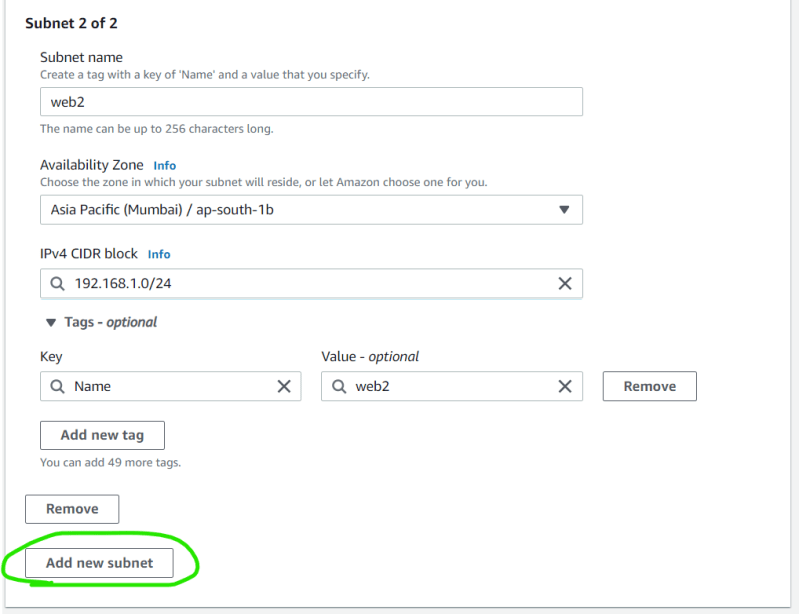

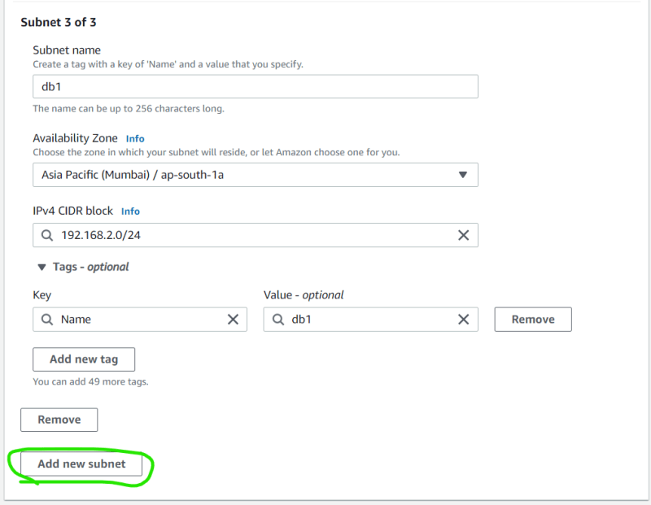

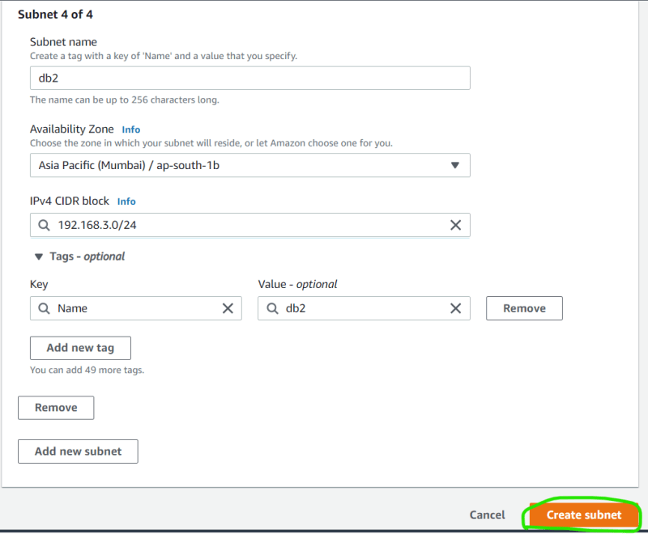

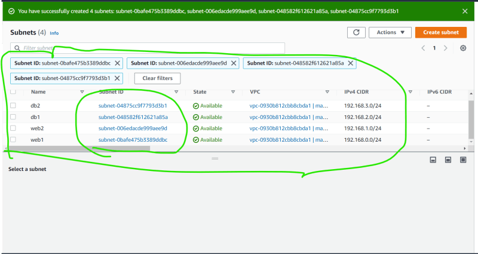


* Provider = aws
* Resource = vpc, subnet
* Lets configure visual studio code to help us with terraform

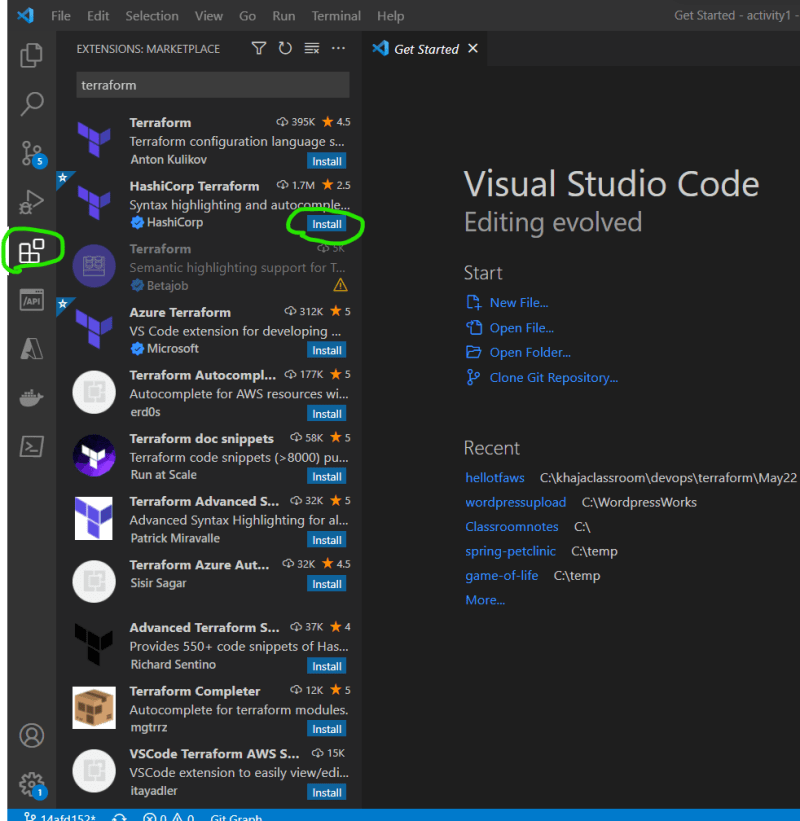

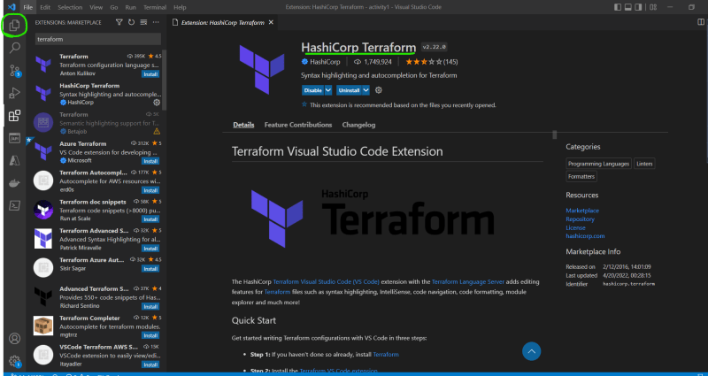

* When terraform commands are executed generally they scan all the .tf files in the directory and execute the configuration.
* [Refer Here](https://registry.terraform.io/providers/hashicorp/aws/latest/docs/resources/vpc) for the vpc documentation

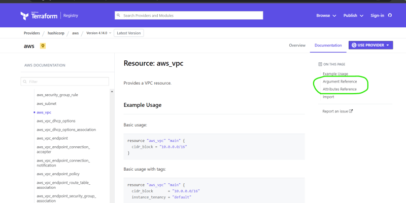

* Lets define the provider and vpc definition

```yaml
provider "aws" {
    access_key  = "LKJLKSKLJDALDJLKSADSLA"
    secret_key  = "lksdfjdlkasfjlsadfjlksdafjlksdafjdallksafj"
    region      = "ap-south-1"
}

# lets try to define the resource for the vpc
resource "aws_vpc" "myvpc" {
    cidr_block = "192.168.0.0/16"

    tags = {
      "Name" = "from-tf"
    }

}
```

* Now perform init and validate. Now lets apply terraform to create infra terraform apply

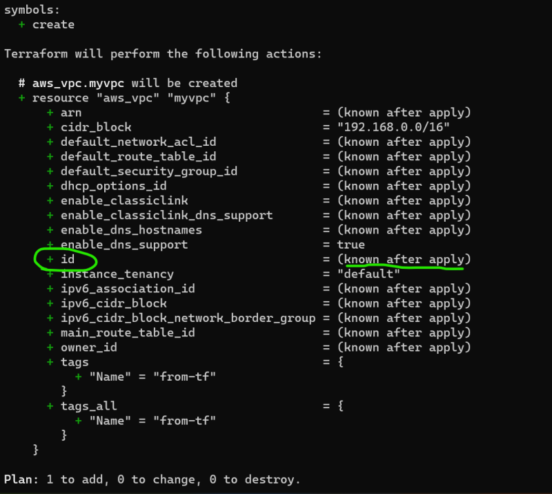

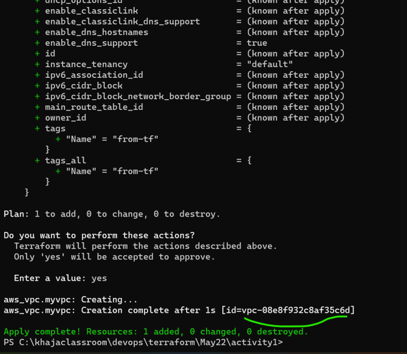

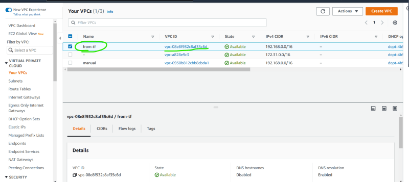

* Now lets try to add web1 and web2 subnets Refer Here for the subnet resource documentation
* The vpc id is the attribute of the resource block to access attributes the syntax is ``` <PROVIDER>_<TYPE>.<NAME>.<ATTRIBUTE-NAME> ```
* We have added the following for the subnets

```yaml
# lets create web1 subnet
resource "aws_subnet" "web1" {
    vpc_id              = aws_vpc.myvpc.id
    cidr_block          = "192.168.0.0/24"
    availability_zone   = "ap-south-1a"

    tags                = {
      "Name"            = "web1-tf"
    }

}

# lets create web2 subnet
resource "aws_subnet" "web2" {
    vpc_id              = aws_vpc.myvpc.id
    cidr_block          = "192.168.1.0/24"
    availability_zone   = "ap-south-1b"

    tags                = {
      "Name"            = "web2-tf"
    }

}
```

* Now validate and apply

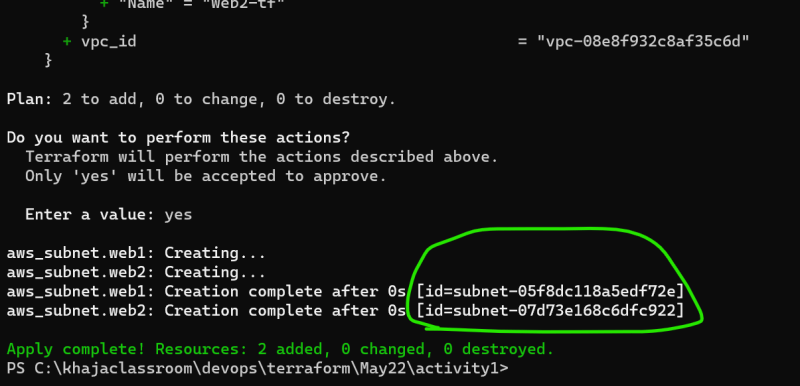

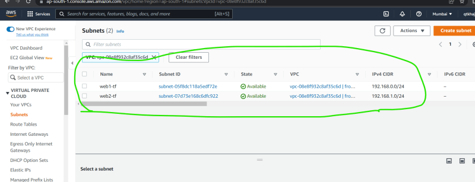

* Now lets create db1 and db2 subnet

```yaml
# lets create db1 subnet
resource "aws_subnet" "db1" {
    vpc_id              = aws_vpc.myvpc.id
    cidr_block          = "192.168.2.0/24"
    availability_zone   = "ap-south-1a"

    tags                = {
      "Name"            = "db1-tf"
    }

}

# lets create db2 subnet
resource "aws_subnet" "db2" {
    vpc_id              = aws_vpc.myvpc.id
    cidr_block          = "192.168.3.0/24"
    availability_zone   = "ap-south-1b"

    tags                = {
      "Name"            = "db2-tf"
    }

}
```

* Now validate and apply

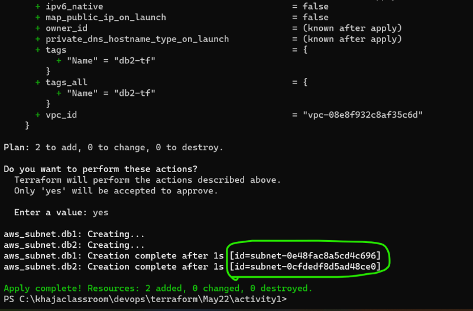

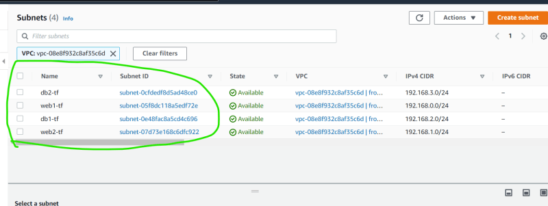
* Next steps:
    * Lets improve the terraform configuration which we have used to create the activity 1.