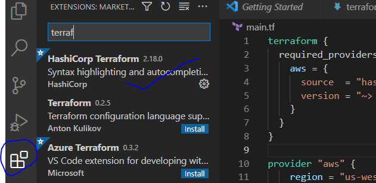
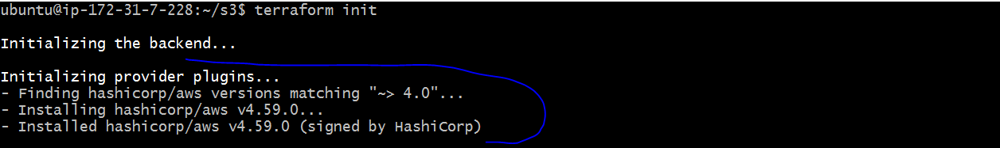
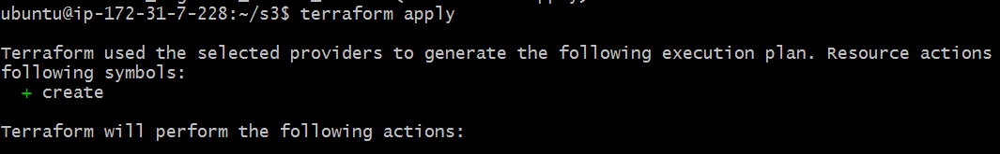
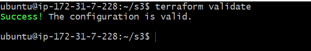
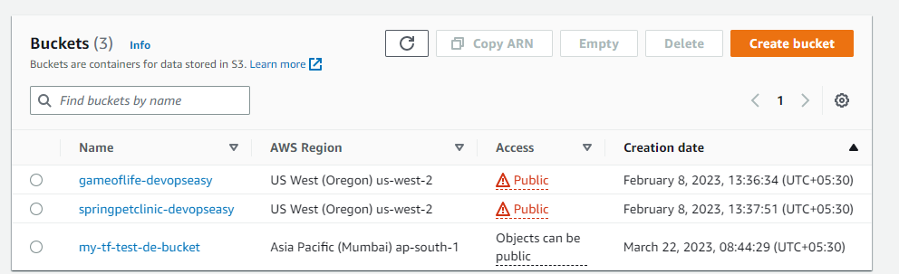
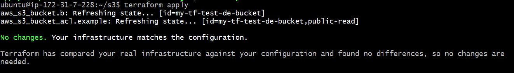
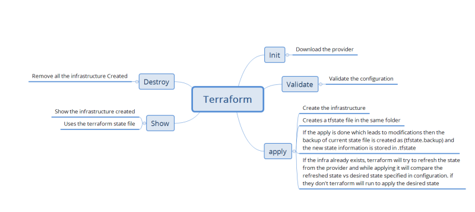

### Create an S3 bucket in AWS Cloud 
* Create a new folder and create an empty file main.tf in it.
* Open this folder with vscode
* Install Terraform Extension from Hashicorp 



* Install AWS CLI
   * Windows => ``` choco install awscli ```
   *  Mac => ``` brew install awscli ```

* Create an IAM authentication as mentioned [Refer Here](https://serverless-stack.com/chapters/create-an-iam-user.html)
* Now execute aws configure and enter the secret access key id and access key, region (us-west-2) and output format => json
* So after configuring credentials. Execute ``` terraform init ``` to download the providers configured 



* Now we need to configure the resource s3_bucket [Refer Here](https://registry.terraform.io/providers/hashicorp/aws/latest/docs/resources/s3_bucket)
* Now fill the required arguments [Refer Here](https://registry.terraform.io/providers/hashicorp/aws/latest/docs/resources/s3_bucket#argument-reference)
* Now lets check for the validity of the configuration which we have written 



* Now try creating the resources by executing ``` terraform apply ```

```
resource "aws_s3_bucket" "b" {
  bucket = "my-tf-de_test-bucket"

  tags = {
    Name        = "My bucket"
    Environment = "Dev"
  }
}

resource "aws_s3_bucket_acl" "example" {
  bucket = aws_s3_bucket.b.id
  acl    = "private"
}
```



* Now check for the resources created or not 



* Once the infra is created, lets execute ``` terraform apply ``` again



* Terraform is idempotent i.e. when you run terraform multiple times to create the infrastructure it will lead to the same result i.e. your desired state
* Now lets change the acl to ``` public-read ``` & apply 
```
resource "aws_s3_bucket" "b" {
  bucket = "my-tf-de_test-bucket"

  tags = {
    Name        = "My bucket"
    Environment = "Dev"
  }
}

resource "aws_s3_bucket_acl" "example" {
  bucket = aws_s3_bucket.b.id
  acl    = "public-read"
}
```

* Now lets try to delete the infrastructure which we have created 

``` terraform destroy ```

* Terraform Workflow



* Next Steps


