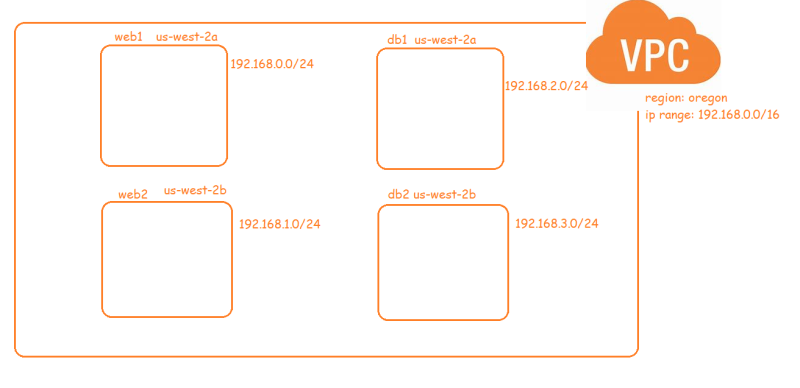

## Create a VPC as specified below



* aws_vpc: [Refer Here](https://registry.terraform.io/providers/hashicorp/aws/latest/docs/resources/vpc)
* aws_subnet: [Refer Here](https://registry.terraform.io/providers/hashicorp/aws/latest/docs/resources/subnet)
* While creating subnet we need vpc id which we can get from the attributes of the vpc resource created. [Refer Here](https://registry.terraform.io/providers/hashicorp/aws/latest/docs/resources/vpc#attributes-reference)
* To use the attributes syntax is ``` <resource-type>.<resource-name>.<attribute-name> ```

```
terraform {
  required_providers {
    aws = {
      source  = "hashicorp/aws"
      version = "~> 4.0"
    }
  }
}

# Configure the AWS Provider
provider "aws" {
  region = "us-west-2"
}
```

```
resource "aws_vpc" "de_vpc" {
  cidr_block = "192.168.0.0/16"
  tags = {
      Name = "primary"
  }
}


resource "aws_subnet" "web_1" {
  vpc_id = aws_vpc.de_vpc.id
  availability_zone = "us-west-2a"
  cidr_block = "192.168.0.0/24"
  tags = {
      Name = "Web1"
  }
}

resource "aws_subnet" "web_2" {
  vpc_id = aws_vpc.de_vpc.id
  availability_zone = "us-west-2b"
  cidr_block = "192.168.1.0/24"
  tags = {
      Name = "Web2"
  }
}


resource "aws_subnet" "db_1" {
  vpc_id = aws_vpc.de_vpc.id
  availability_zone = "us-west-2a"
  cidr_block = "192.168.2.0/24"
  tags = {
      Name = "db1"
  }
}

resource "aws_subnet" "db_2" {
  vpc_id = aws_vpc.de_vpc.id
  availability_zone = "us-west-2b"
  cidr_block = "192.168.3.0/24"
  tags = {
      Name = "db2"
  }
}

```