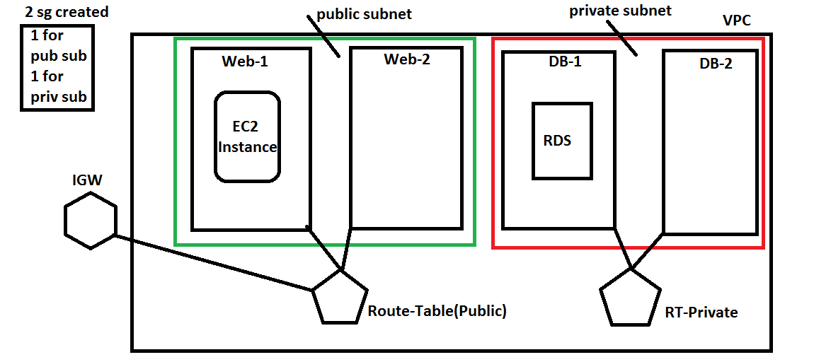

## AWS Security Group & EC2 Instance
* AWS Infra Setup Architecute

* Now we need to create a ec2 instance (virtual machine), So lets try to understand how to do it manually.
* While creating ec2 instance, we provide following inputs
       * ami-id
       *  network settings:
            * vpc-id
            * subnet-id
            * public ip => Enabled/Disabled
       *  Tags
           * Security Group Preview
           * Key-Pair
* Lets try to create a security group for web servers
   * Allow all traffic on SSH (TCP=>22), HTTP(TCP=>80), HTTPS(TCP=>443)
* [Refer Here](https://registry.terraform.io/providers/hashicorp/aws/latest/docs/resources/security_group) for the documentation.
* [Refer Here](https://github.com/DevopsEasy/Terraform/tree/main/terraformfiles/day6) for files.
* Lets also use locals to represent the values which we are using in terraform configuration but we dont expect these values as user inputs [Refer Here](https://www.terraform.io/language/values/locals)
* Lets create a security group for database => Postgres (5432)
* [Refer Here](https://github.com/DevopsEasy/Terraform/tree/main/terraformfiles/day6) for files.

## Internet Gateway & Route Table creation

* Now for public connectivity, lets create an internet gateway and attach it to the vpc
* [Refer Here](https://registry.terraform.io/providers/hashicorp/aws/latest/docs/resources/internet_gateway) for the internet gateway resource
To create route tables [Refer Here](https://registry.terraform.io/providers/hashicorp/aws/latest/docs/resources/route_table)
Now we need to associate route tables to subnets [Refer Here](https://registry.terraform.io/providers/hashicorp/aws/latest/docs/resources/route_table_association)
After making the changes as mentioned [Refer Here](https://github.com/DevopsEasy/Terraform/tree/main/terraformfiles/day6), We are able to login into ec2 instance created
