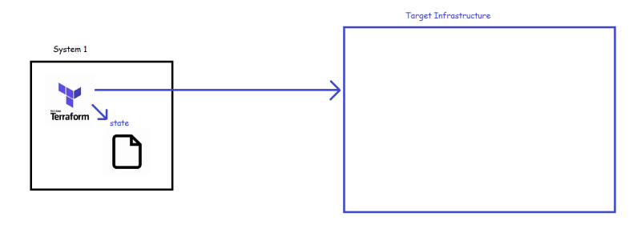
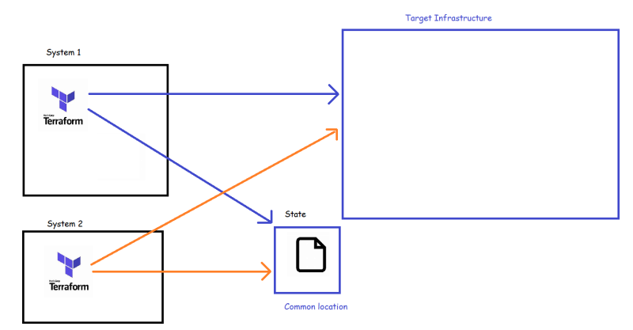
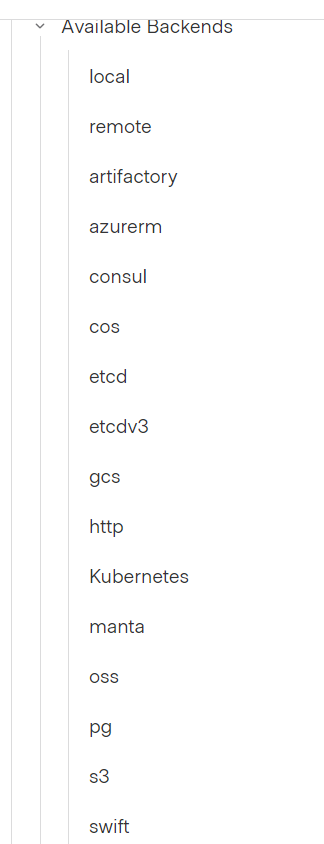

### Terraform State
* Terraform maintains the information of resources created in the state file.
* This file contains a custom JSON format that records a mapping from the Terraform resources in your configuration files to a representation of those resources in the real world (Provider).
* When we execute terraform apply, terraform first fetches the information from provider about the resources in state file and compares that to the state file, if there any changes required to match what you want (expressed) in your configuration file, terraform executes them
* terraform state matches with existing resources
* Ideally terraform state should be stored in common location for multiple users to execute the terraform apply leading to same infra, we will be learning terraform backends.

## Terraform Backends
* Terraform by default when applied to create infrastructure will create a local state file, so when multiple users execute the terraform on multiple machines it leads to creation of multiple target infrastructures which is not idle.




* The solution for this is if we can store the state file in some common location which is referred as ```Backend```, then even if multiple users try to apply it leads to same infrastructure.




* To avoid multiple users writing to the state file at the same time, terraform implements locking
[Refer Here](https://developer.hashicorp.com/terraform/language/settings/backends/configuration) for the official docs of the backend
Terraform supports the following backends




* Lets implement the backend using s3 based backend

## AWS S3 Backend

* [Refer Here](https://developer.hashicorp.com/terraform/language/settings/backends/s3) for official docs
* Create an s3 bucket
* Lets create a dynamodb table for locking purposes
* Now initialize
```
terraform init
```
* And Apply

```
terraform apply
```
* As this user has acquired the lock which will be released upon completion of terraform execution till that moment no other user will be able to create infra.

### Datasource
* Datasource help in fetching the information about some resources in the provider.
* Lets try to query the aws to get the vpc id of the default vpc
* [Refer Here](https://developer.hashicorp.com/terraform/language/data-sources) for the usage syntax of datasources
* [Refer Here](https://registry.terraform.io/providers/hashicorp/aws/latest/docs/data-sources/vpc) for the datasource of aws vpc
* The following changeset is used to pull the defult vpc id of mumbai region and subnetids of any vpc from az ap-south-1a 
```
data "aws_vpc" "default" {
    default = true
}

data "aws_subnets" "subnetids" {
    filter {
      name = "availability-zone"
      values = [ "ap-south-1a" ]
    }


}

output "defaultvpcid" {
    value = data.aws_vpc.default.id
}

output "subnetids" {
    value = data.aws_subnets.subnetids.ids
}


```

* In class we did this

```
data "aws_vpc" "myvpc" {
    default = true
}

output "myvpc" {
  value = data.aws_vpc.myvpc
}


data "aws_vpc" "nt-demo" {
    filter {
        name = "tag:Name"
        values = ["vpcdemo"]
    }
  
}

resource "aws_subnet" "main" {
  vpc_id     = data.aws_vpc.mydemopvpc.id
  cidr_block = "192.168.5.0/24"

  tags = {
    Name = "Mydemo-vpc"
  }
}


data "aws_ami" "example" {
  most_recent      = true
  owners           = ["099720109477"]

  filter {
    name   = "name"
    values = ["ubuntu/images/hvm-ssd/ubuntu-jammy-22.04-amd64-server-20230325"]
  }

  filter {
    name   = "root-device-type"
    values = ["ebs"]
  }

  filter {
    name   = "virtualization-type"
    values = ["hvm"]
  }
}

output "aws-ami-id" {
  values = data.aws_ami.example.id
}

resource "aws_instance" "web" {
  ami           = data.aws_ami.example.id
  instance_type = "t2.micro"

  tags = {
    Name = "HelloWorld"
  }
}
```

```
terraform {
  required_providers {
    aws = {
      source  = "hashicorp/aws"
      version = "~> 3.0"
    }
  }
}

# Configure the AWS Provider
provider "aws" {
  region = "us-west-2"
}
```
